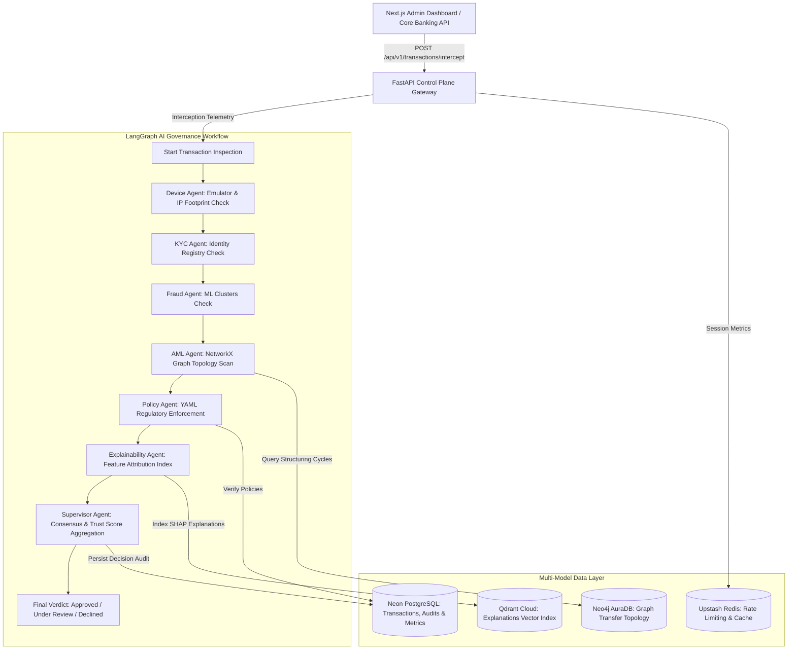

# AegisAI: AI Governance Operating System for Banking

AegisAI is an enterprise-grade AI Governance Operating System designed to supervise, monitor, stress-test, explain, and audit autonomous AI agents operating in banking environments. It ensures real-time compliance, risk mitigations, transactional trust scoring, and explainability for financial systems.

---

## 🌐 Production URLs

* **Frontend Dashboard (Vercel)**: [https://aegis-phi-five.vercel.app/](https://aegis-phi-five.vercel.app/)
* **Control Plane API Gateway (Render)**: [https://aegis-xo10.onrender.com](https://aegis-xo10.onrender.com)

---

## 🏗️ System Architecture

The AegisAI platform operates as a high-throughput transaction inspection gateway. Transaction payloads are orchestrated asynchronously through a LangGraph workflow containing domain-specific inspection agents, voting engines, and deterministic policy gates before persisting results in our multi-model data layer.



---

## 🧠 Key Modules

* **AI Orchestrator**: Manages execution state and coordinates async LangGraph execution flows across all sub-agents.
* **Domain Sub-Agents**:
  * **Device Agent**: Evaluates emulator profiles, network routing, and device fingerprint risk indices.
  * **KYC Agent**: Processes customer identity verifications and active database matches.
  * **Fraud Agent**: Screens transaction properties using Scikit-Learn classifiers (`RandomForestClassifier`, `GradientBoostingClassifier`).
  * **AML Agent**: Builds and scans transaction topology networks using `NetworkX` to detect structuring (smurfing) loops and cycle loops.
  * **Policy Agent**: Dynamically parses YAML specifications in `configs/policies.yaml` to enforce strict regulatory compliance.
* **Explainability Engine**: Computes deterministic SHAP feature attributions and generates natural language justifications.
* **Trust Score Engine**: Aggregates agent output matrices, latency metrics, and consensus alignment to calculate a unified safety trust index (0-100).
* **Consensus Engine**: Determines final transaction decisions by weighting sub-agent votes based on historic performance and execution confidence.
* **Chaos Engine**: Runs simulated infrastructure failures, data drift, and network latencies to audit control plane resilience.

---

## 📂 Directory Structure

```
AegisAI/
├── .agents/             # Agent guidelines & workspace configurations
├── agents/              # Orchestrator & LangGraph sub-agent nodes
├── backend/             # FastAPI REST Gateway, control routes & startup hooks
│   ├── app/
│   │   ├── config/      # System settings & environment loaders
│   │   ├── database/    # Relational, caching, graph & vector db connections
│   │   ├── models/      # SQLAlchemy relational models
│   │   ├── schemas/     # Pydantic request/response serializers
│   │   └── services/    # Business logics (Trust, Consensus, Chaos, PDF Generator)
│   └── tests/           # 57/57 Pytest verification suite
├── configs/             # YAML policies and system rules presets
├── frontend/            # Next.js App Router executive dashboard
├── ml/                  # ML model architectures and training pipelines
├── monitoring/          # Prometheus, Prometheus-Pushgateway, & Grafana config
├── research/            # Research paper whitepaper, twin core simulators, & notebooks
├── scripts/             # Seeding scripts & data load simulator
└── docker-compose.yml   # Multi-service infrastructure orchestration profile
```

---

## 🛠️ Local Quickstart

### Prerequisites
* Python 3.12+
* Node.js 20+
* Docker & Docker Compose

### 1. Run Multi-Model Infrastructure
```bash
docker-compose up -d
```

### 2. Configure Environment
Create a `.env` file in the root directory:
```bash
cp .env.example .env
```

### 3. Migrate and Seed Databases
```bash
cd backend
pip install -r requirements.txt
alembic upgrade head
python ../scripts/banking_simulator.py
```

### 4. Boot Backend Gateway
```bash
uvicorn app.main:app --reload --port 8000
```

### 5. Boot Frontend Dashboard
```bash
cd ../frontend
npm install
npm run dev
```
Open [http://localhost:3000](http://localhost:3000) in your browser.

---

## 🧪 Verification & Testing

Verify system correctness by executing the test harness:
```bash
python -m pytest
```
*Verification standard: 57 tests passed, 0 failures.*

---

## 📜 License
This project is licensed under the MIT License - see the [LICENSE](LICENSE) file for details.
