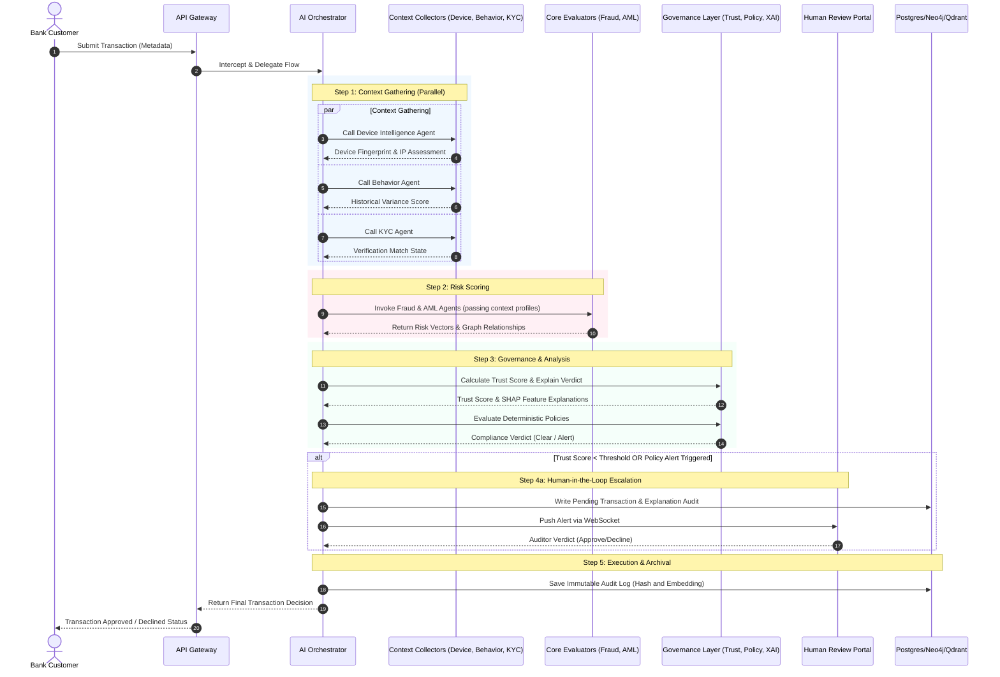

# System Transaction Flow & Pipelines

This document details the operational pipelines and transaction execution flows governing AI agents inside AegisAI.

---

## 1. Governance Processing Pipeline

Below is the step-by-step transaction flow executing inside the AI Orchestrator:

---

## 2. Processing Pipeline Steps

### Step 1: Context Gathering (Parallel Phase)
The Orchestrator receives the transaction payload. It calls the **Device Agent**, **Behavior Agent**, and **KYC Agent** concurrently to evaluate the background environment of the request. Doing this in parallel reduces gateway latency.

### Step 2: Core Risk Scoring
Using the combined user identity, device posture, and historical context variables, the Orchestrator executes the **Fraud Agent** (statistical risk) and **AML Agent** (relationship graphing in Neo4j).

### Step 3: Governance & Safety Calculations
The raw outputs of the agents are analyzed by the control plane:
- The **Trust Score Engine** weighs the data drift, confidence metrics, and device health to calculate a dynamic score.
- The **Explainability Engine** triggers SHAP calculation to trace which input features (e.g. device IP, transfer speed, transfer amount) contributed to the risk output.
- The **Policy Engine** runs checks against regulatory rules.

### Step 4: Human-in-the-Loop (HITL) Intervention
If a transaction triggers a high-severity policy alert or has a Trust Score below the configured threshold, the transaction is marked as `pending` and written to PostgreSQL. A message is broadcasted via WebSockets to active review screens.

### Step 5: Archival
Once resolved (automatically or by an auditor), the final state is committed to PostgreSQL, and the explainability explanation is converted into vector embeddings and logged inside PostgreSQL/pgvector for subsequent audit searches.
