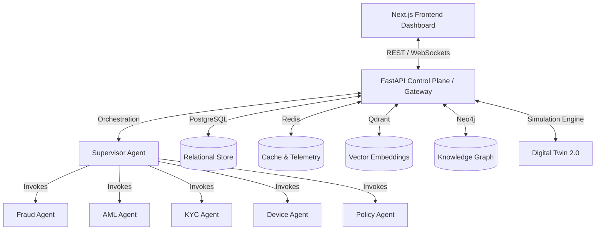

# AegisAI Implementation Progress Report

AegisAI is an AI Governance Operating System designed for banking environments to supervise, monitor, stress-test, explain, and audit autonomous AI agents. Below is the complete current status of the codebase across the frontend, backend, agent sandbox, and infrastructure layers.

---

## 🏗️ Architecture & Component Flow

---

## 📊 Summary of Completed Work

| Layer | Component | Description / Status | Associated Files |
| :--- | :--- | :--- | :--- |
| **Frontend** | **Human Review Center** | Interactive terminal for auditors to review low-trust transactions, trace warning flags, check policy rules, view SHAP graphs, and issue verdicts. | [page.tsx](file:///c:/Users/basit/Downloads/NEW%20PROJJ/frontend/src/app/reviews/page.tsx) |
| **Frontend** | **AI Governance Studio** | Studio module containing visual workflow DAG editor, node configurations, execution runs history, and pipeline triggers. | [studio/page.tsx](file:///c:/Users/basit/Downloads/NEW%20PROJJ/frontend/src/app/dashboard/studio/page.tsx) |
| **Frontend** | **Digital Twin 2.0** | Simulation dashboard where stress-test scenarios (e.g. cyberattacks, high volume) can be configured, executed, and analyzed. | [simulation/page.tsx](file:///c:/Users/basit/Downloads/NEW%20PROJJ/frontend/src/app/dashboard/simulation/page.tsx) |
| **Frontend** | **MLOps Monitoring** | Interface for tracking registered AI models, managing staging/production deployment tags, and configuring traffic routing (Canary, Shadow, A/B). | [mlops/page.tsx](file:///c:/Users/basit/Downloads/NEW%20PROJJ/frontend/src/app/dashboard/mlops/page.tsx) |
| **Frontend** | **Other Dashboards** | Pages for Consensus, Policy limits, Chaos engineering, Trust metrics, Knowledge Graphs, Copilot chat, and Self-Healing activities. | `frontend/src/app/*` |
| **Backend** | **FastAPI Control Plane** | Entrypoint app router configuring Lifespan contexts, global error mapping, CORSMiddleware, and sub-routers. | [main.py](file:///c:/Users/basit/Downloads/NEW%20PROJJ/backend/app/main.py) |
| **Backend** | **Database Connectors** | Async SQLAlchemy engine for PostgreSQL pool, Redis client connection, and Qdrant/Neo4j configurations. | [database.py](file:///c:/Users/basit/Downloads/NEW%20PROJJ/backend/app/database/database.py) |
| **Backend** | **Orchestrator APIs** | Endpoints for running simulation scenarios, workflow pipelines, managing reviewers, security policies, and consensus voting. | `backend/app/api/v1/endpoints/*` |
| **AI Agents** | **Supervisor Orchestrator**| Gathers sub-agent confidence scores, computes a weighted **Trust Index Score** (0-100), and outputs deterministic verdicts. | [supervisor.py](file:///c:/Users/basit/Downloads/NEW%20PROJJ/agents/supervisor.py) |
| **AI Agents** | **Domain Sandboxes** | Individual scoring/evaluation models for transaction risks, structural AML loops, document validity, and device fingerprints. | `agents/{fraud, aml, kyc, device, policy, graph}.py` |
| **Scripts** | **Digital Twin Simulators**| PowerShell bootstrapper and Python transaction generators that seed PostgreSQL with mock financial transactions. | [run_simulator.ps1](file:///c:/Users/basit/Downloads/NEW%20PROJJ/scripts/run_simulator.ps1) |

---

## 🔍 In-Depth Details by Layer

### 1. Next.js Frontend App Router (`frontend/`)
The frontend is built as a responsive Next.js application with a premium developer/auditor dark mode. Highly polished pages include:
- **`reviews/`**: Features an evidence viewer dashboard with SLA trackers, SHAP value visualizations, decision forms for human auditors to override/escalate cases.
- **`dashboard/studio/`**: A graphical studio workflow manager to configure node DAG execution paths (e.g. connecting Device Agent -> Fraud Agent -> Compliance Check).
- **`dashboard/simulation/`**: Controls Digital Twin simulations. Scenarios can be fired to stress-test policies against simulated attack streams, showing live dashboards.
- **`dashboard/mlops/`**: Tracks registered model version tags (e.g. shadow vs production) and implements dynamic routing configs.

### 2. FastAPI Control Plane (`backend/app/`)
The API gateway acts as the centralized control plane connecting the frontend, the agent workspace, and relational/non-relational databases:
- **Security & Auth**: Custom JWT decoding, endpoint route validation decorators, and policy controls (such as `require_permission`).
- **Engines**: 
  - `workflow_engine.py`: Responsible for building execution topologies and running them node-by-node.
  - `simulation_engine.py`: Runs background simulation worker loops based on defined stress scenarios.
- **Models/Repositories**: Alembic migration-ready SQLAlchemy mappings for transaction ledger logs, workflows, simulations, reviewers, and audit records.

### 3. AI Governance Agents (`agents/`)
Agents inherit from a unified [BaseGovernanceAgent](file:///c:/Users/basit/Downloads/NEW%20PROJJ/agents/base.py) class. When a transaction is intercepted:
- **Supervisor Agent** coordinates:
  - **Fraud Agent** (checks limits and scores risk)
  - **Device Agent** (flags emulator profiles & IP reputations)
  - **AML Agent** (analyzes transactional topology logs)
  - **KYC Agent** (verifies document alignment matches)
  - **Policy Agent** (applies hard regulatory boundaries)
- **Supervisor** combines outputs into a **Trust Score** via a weighted formula:
  $$\text{Trust Score} = (0.35 \times \text{Fraud} + 0.25 \times \text{Device} + 0.20 \times \text{Policy} + 0.20 \times \text{KYC}) \times 100$$
- If the Trust Score falls below $50$ or a policy fails, the transaction is **declined**. If it is between $50$ and $75$, it is routed to **human review**; otherwise, it is **approved**.

---

## 🎯 Next Steps / Pending Roadmap Actions

Referring to the [ROADMAP.md](file:///c:/Users/basit/Downloads/NEW%20PROJJ/docs/ROADMAP.md), the system scaffolding and core complex logic (simulation engine, workflow DAGs, MLOps control) are built. Pending tasks are:
1. **Fully Connect Transaction Ingestion (`/transactions/intercept`)**:
   Currently, `backend/app/api/v1/endpoints/transactions.py` is placeholder scaffolding. We need to implement the full intercept handler which routes requests through the Supervisor Agent and saves them to the PostgreSQL database.
2. **Setup Real ML Models (Phase 3)**:
   Integrate real classification estimators (like XGBoost for Fraud detection, Isolation Forest for Behavior drift anomalies) to replace mocked thresholds.
3. **Refine explainability vector logs**:
   Configure Qdrant/pgvector indexing of historical natural language explanations.
